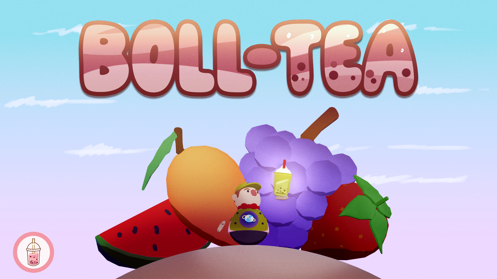
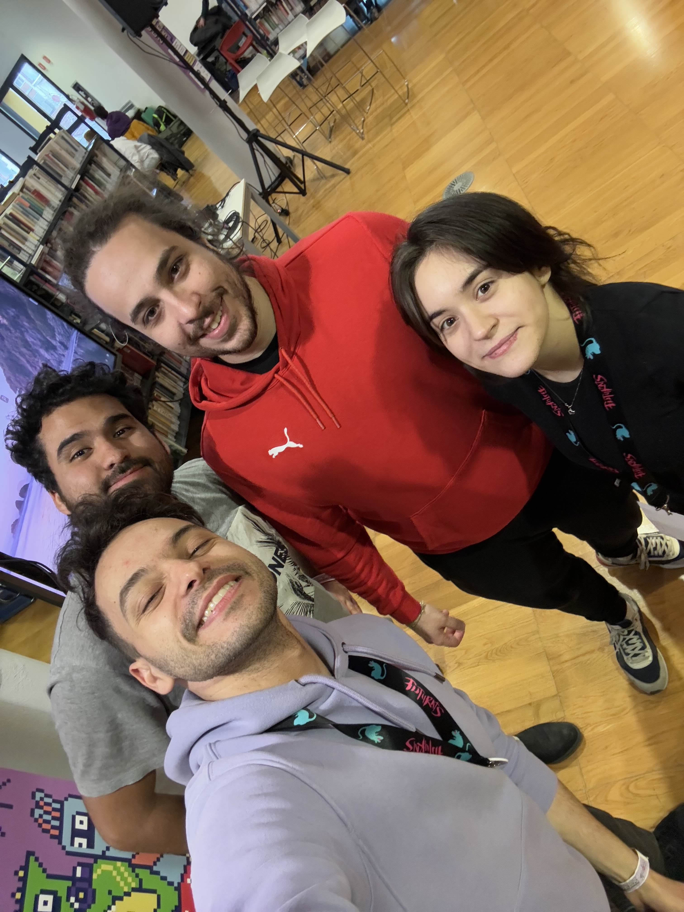
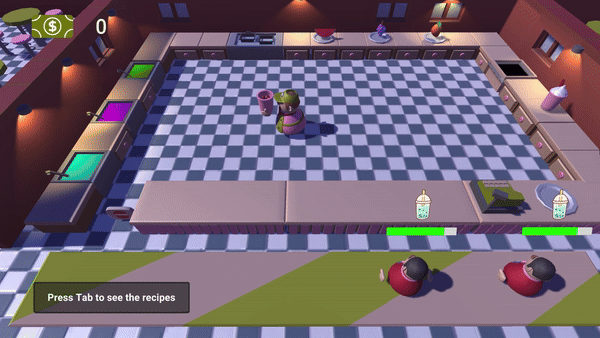

# Boll-Tea

  

## 🎮 About the Game

**Boll-Tea** is a frantic, single-player cooking game inspired by the beloved **Overcooked** series, designed for a **Game Jam** under the theme: **Bubbles**. Dive into a chaotic kitchen environment where you prepare delicious bubble teas to satisfy an endless stream of demanding customers. The game is packed with:

- 🌀 **Cartoonish Graphics**: Bright, playful visuals inspired by Overcooked’s iconic art style.
- 🎶 **Immersive SFX and Music**: Fun, satisfying sound effects and background music to keep your adrenaline pumping.
- 💥 **Dynamic Animations & Particle Effects**: Vibrant particle effects and smooth animations bring the kitchen to life.

## 🌟 Theme Inspiration: Bubbles

The Game Jam’s theme, **Bubbles**, inspired us to design a game around the chaotic joy of bubble tea preparation. We wanted to recreate the **fun and frenzy** of a bubble tea shop with an emphasis on **fast-paced challenges** and **satisfying gameplay loops**.

Drawing inspiration from Overcooked, we’ve crafted a cartoonish, lighthearted environment where:

- Players face **progressive challenges** with increasing customer demands.
- The quirky mechanics of bubble tea preparation bring a unique twist to the cooking genre.
- **Animations and SFX** immerse you in a whimsical, stress-inducing experience that’s still incredibly fun!

  
  

## 🎯 Gameplay Features

- **Time-Based Challenges**: Serve as many bubble teas as you can before the timer runs out!
- **Dynamic Customer Orders**: Each customer has unique preferences, so stay sharp and adapt fast.
- **Interactive Kitchen Environment**: Juggle tasks like brewing tea, adding toppings, and customizing drinks with precision.
- **Fun Visuals and Effects**: Enjoy satisfying particle effects and cartoonish animations as you work under pressure.

## 👨‍🍳 Meet the Team

Boll-Tea was created by a passionate group of game developers during a Game Jam:

- **Davide Paolillo**
- **Jesus Subero**
- **Giorgio Villani**
- **Alice Ottaviani**
- **Andrea Monopoli**

  

## 🛠️ How to Play

1. Download the game from [Game Jam Page](https://globalgamejam.org/jam-sites/2025/archimede-game-jam-2025).
2. Run the executable and get ready for the frenzy!
3. **Controls**:
   - Move: `WASD`
   - Interact: `E`
   - Delivery to the client: `F`
4. Fulfill customer orders by completing all the steps for each bubble tea before time runs out.

## 📸 Screenshots & Media

### Animations & Effects:

  

## 🔗 Links

- [Game Jam Page](https://globalgamejam.org/jam-sites/2025/archimede-game-jam-2025)
- [GitHub Repository](https://github.com/dame-time/boll-te)

## ❤️ Why We Loved Making This Game

Recreating the **Overcooked-like gameplay** in a single-player context was both a challenge and a joy. Our team poured their creativity into:

- Designing a visually engaging kitchen inspired by the **bubbles** theme.
- Developing satisfying animations, sound effects, and particle systems.
- Crafting fast-paced mechanics that capture the chaotic fun of bubble tea preparation.

## 🧋 Thank You for Playing!

We hope you enjoy the chaotic fun of **Boll-Tea** as much as we loved creating it. Good luck keeping up with the bubble tea madness!
